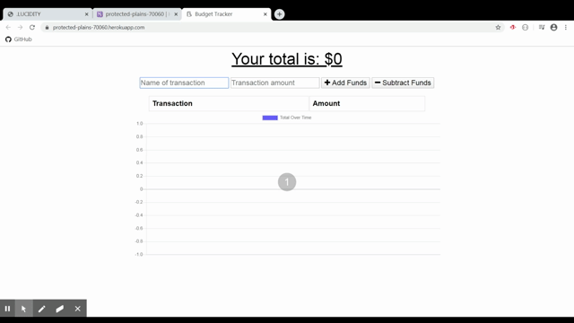
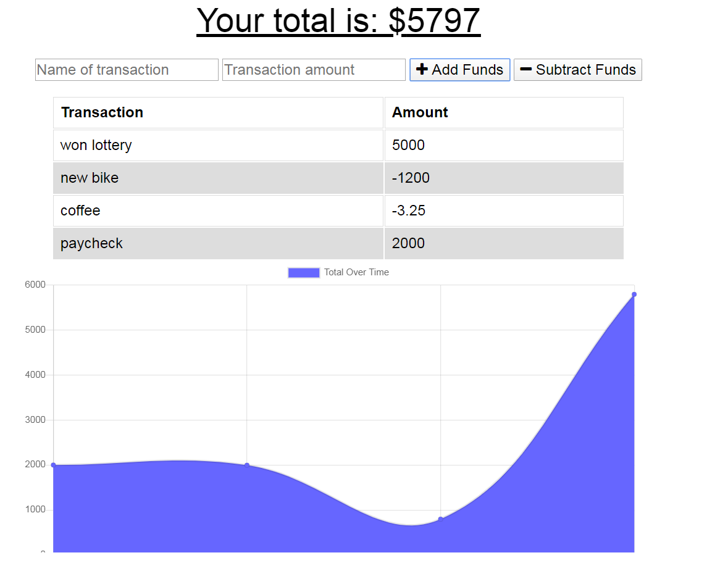

# BudgetTracker
A budget tracking app that functions on- or offline.

This heroku-deployed app uses MongoDB to take user input for tracking income and expenses, including chart-based visuals. The deployed version is available at: https://protected-plains-70060.herokuapp.com/.

